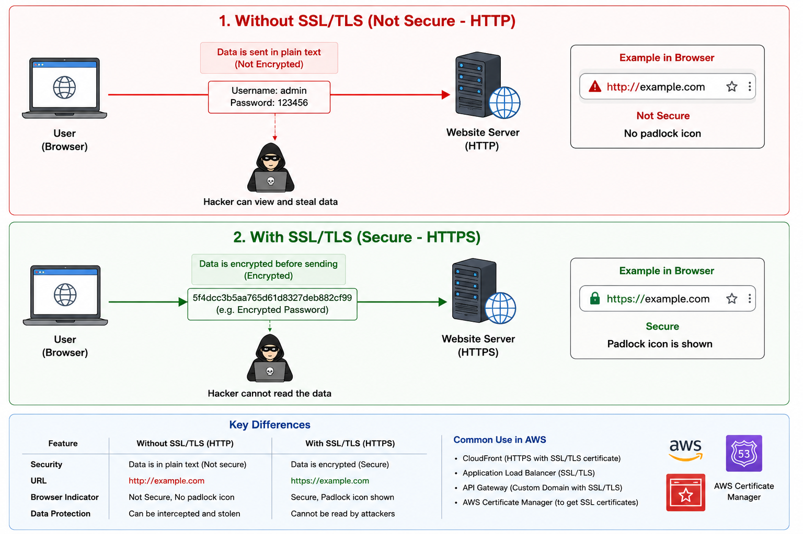

## SSL (Secure Sockets Layer)

**SSL** is a security protocol that encrypts data sent between a user's browser and a server.

> **Note:** SSL is now obsolete and has been replaced by **TLS**.

---

## TLS (Transport Layer Security)

**TLS** is the newer, more secure version of SSL.

It encrypts data so that attackers cannot read or modify it during transmission.

---

## Example

Without SSL/TLS:

```text
Browser  ---- Password ----> Server
```

Anyone intercepting the traffic could read the password.

With SSL/TLS:

```text
Browser === Encrypted Data ===> Server
```

The data is encrypted and unreadable to attackers.

---

## How to identify it?

- ✅ `https://example.com` → Uses SSL/TLS
- ❌ `http://example.com` → Not encrypted

The padlock 🔒 in the browser indicates the site is using TLS (often still referred to as an "SSL certificate").

---

## AWS Example

When you use:

- **CloudFront**
- **Application Load Balancer (ALB)**
- **API Gateway**

you typically attach an **SSL/TLS certificate** (from **AWS Certificate Manager**) so users can access your site securely over HTTPS.

---

## Interview (1 line)

> **SSL and TLS are cryptographic protocols that encrypt communication between clients and servers. TLS is the modern, more secure replacement for SSL.**


